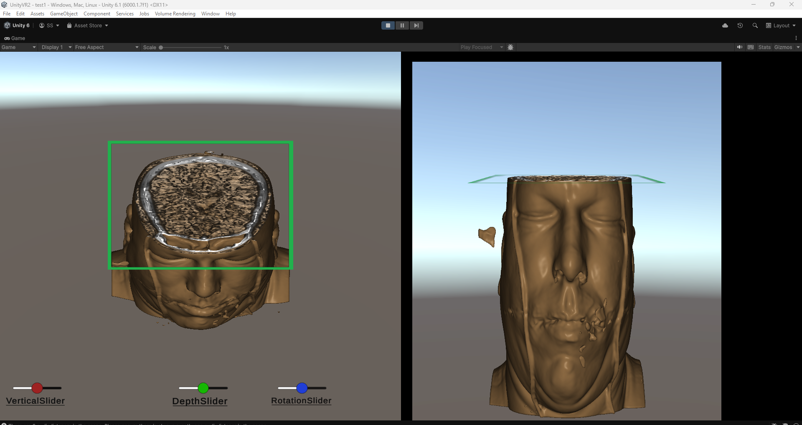
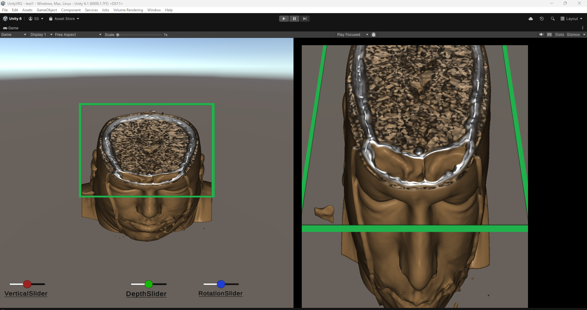
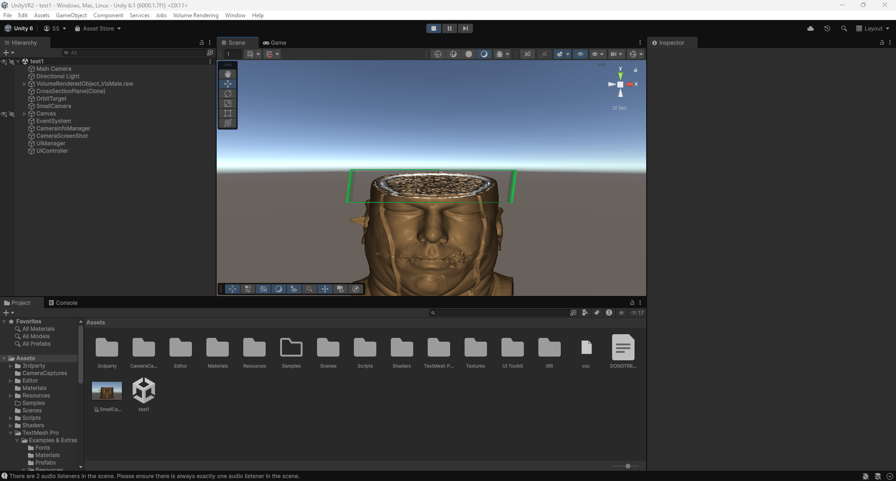
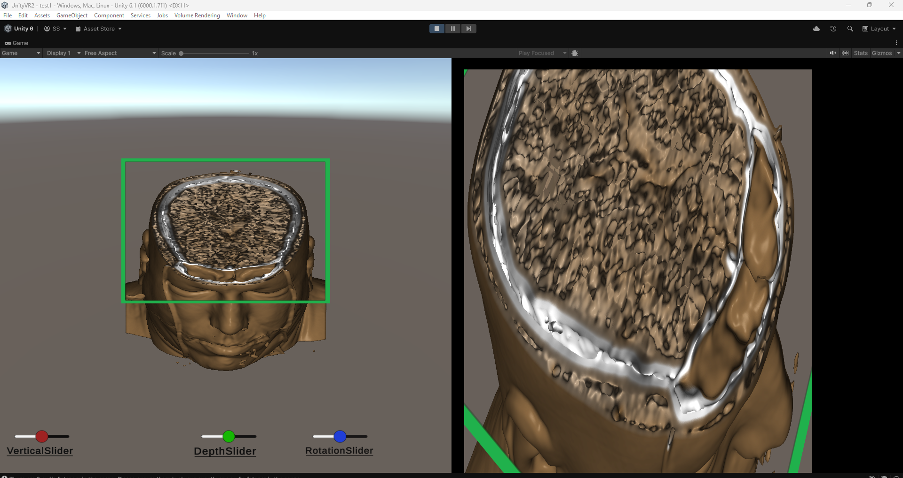
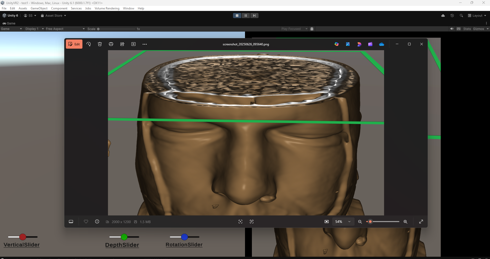
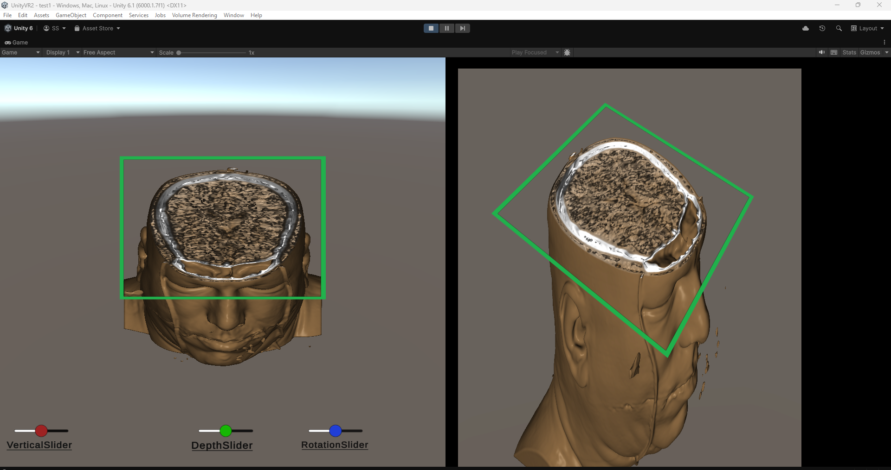

# 🧠 Interactive 3D Medical Image Viewer with Slice Navigation and Dynamic Zoom

This Unity-based project provides an interactive 3D medical image viewer that allows MRI technicians and doctors to **explore a volumetric rendering of the human head** using MRI slice images. Users can dynamically adjust cross-sectional slices, move a secondary camera for inspection, zoom into specific areas, and capture high-quality screenshots of the 3D head.

[🔗 GitHub Repository](https://github.com/sreeragss/UnityVolumeRenderingProject.git)

---

## 📌 Project Overview

The project uses a **fixed main camera** and a **movable secondary camera** to explore a 3D volume-rendered MRI dataset. With real-time slice control and camera zoom features, this viewer offers a powerful tool for visualizing internal anatomical structures.

---

## ✨ Key Features

- ✅ **3D Volume Rendering from 2D MRI Slices**  
  Converts a stack of 2D MRI images into a fully navigable 3D head model.

- ✅ **Slice Navigation UI**  
  Change the slice orientation (XY, XZ, YZ) and position using on-screen UI.

- ✅ **Secondary Camera Control**  
  Rotate, move, and zoom the camera freely using mouse input.

- ✅ **Zoom into Internal Regions**  
  Explore the inside of the head structure interactively.

- ✅ **Screenshot Capture**  
  Press the `S` key to take a snapshot from the secondary camera. The image is saved to the local folder.

---

## 🛠️ Technologies Used

- Unity 3D (version: `6000.1.7f1`)
- C#
- [UnityVolumeRendering](https://github.com/mlavik1/UnityVolumeRendering)
- Unity UI Toolkit
- Mouse-controlled camera system
- Screenshot API

---

## 📥 How to Open and Use the Project

Follow the steps below to set up and operate the project in Unity:

1. **Download the Project**  
   Clone or download this repository and extract the ZIP file to your preferred location.

2. **Open in Unity Hub**
   - Launch **Unity Hub**
   - Click `Add > Add project from disk`
   - Select the **extracted folder location**
   - You will now see the project listed in Unity Hub

3. **Open in Unity Editor**
   - Click on the project to open it in **Unity Editor**  
     _(Make sure Unity version `6000.1.7f1` is installed)_

4. **View the 3D Volume**
   - In the **Project panel**, go to:  
     `Assets > test1`
   - Double-click `test1` to load the scene containing the 3D volume rendering

5. **Play the Scene**
   - Click the **Play** ▶️ button to enter Game mode

6. **Control the Cameras**
   - 🎥 **Main Camera**: Fixed view of the 3D head
   - 🎮 **Secondary Camera**:
     - **Right-click + drag mouse**: Rotate around the head
     - **Mouse scroll**: Zoom in/out
     - **Use UI buttons** to switch cross-sectional plane (XY, XZ, YZ)

7. **Capture Screenshot**
   - Press the **`S` key** during Game mode
   - A screenshot from the secondary camera will be saved to your local folder

---

## 📸 Example Screenshots

> To display screenshots here, place your image files (e.g., `screenshot1.png`) in your project (e.g., `Assets/Screenshots/`) and reference them like below:

```markdown






```

_Replace the filenames and paths with your actual image names._

---

## 🔮 Future Scope

- 🥽 Direct VR headset support using Unity XR Toolkit
- 🖊️ Annotation and measurement tools for diagnostic use
- 🧠 Automatic tissue/region highlighting using machine learning
- 📁 Support for DICOM file loading and PACS integration
- 💡 Medical education and training applications

---

## 📧 Contact

If you would like to contribute, report issues, or collaborate, feel free to reach out via GitHub Issues or Pull Requests.

---

> Developed with 💙 using Unity to support medical imaging, analysis, and education.
